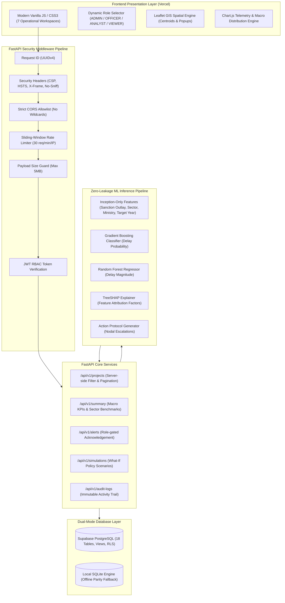

# System Architecture Documentation
**Project:** PM-OCMS Infrastructure Delay & Cost Overrun Intelligence Platform (SIH26017)  
**Version:** 2.1.0-production-spec  
**Classification:** Government-Style Decision-Support System Prototype

---

## 1. High-Level Architectural Overview

The system provides an early-warning and decision-support platform designed to monitor 1,981 central sector infrastructure projects (outlay >₹150 Cr) across India. It couples econometric benchmarking with zero-leakage machine learning and interactive policy simulation.

```
+-----------------------------------------------------------------------------+
|                          PRESENTATION LAYER (Vercel)                        |
|   Vanilla HTML5 / Modern CSS3 / Client Controller (app.js)                  |
|   - 7 Functional Workspaces: Executive Overview, Project Explorer,          |
|     Early Warning Evaluator, What-If Policy Simulator, Alerts Feed,         |
|     Land & GIS Spatial Demo, Data Quality & Integrity Audit                 |
|   - Interactive Role Selector (ADMIN / OFFICER / ANALYST / VIEWER)          |
+-----------------------------------------------------------------------------+
                                       |
                             HTTPS + Bearer JWT
                                       v
+-----------------------------------------------------------------------------+
|                         APPLICATION GATEWAY (FastAPI)                       |
|   Middleware Pipeline:                                                      |
|   1. Request ID Generation (UUIDv4)                                         |
|   2. Security Headers (CSP, HSTS, X-Frame, X-Content-Type)                  |
|   3. Explicit CORS Allowlist Validation                                     |
|   4. Sliding Window Rate Limiting (Token Bucket per IP)                    |
|   5. Authentication & Server-Side RBAC Enforcement                          |
|   6. Global Sanitized Exception Handling                                    |
+-----------------------------------------------------------------------------+
                                       |
                                       +-------------------+
                                       |                   |
                                       v                   v
+------------------------------------------+  +-------------------------------+
|     CORE SERVICE / ROUTING LAYER         |  |   ML INFERENCE PIPELINE       |
|  - /api/v1/projects (Server Pagination)  |  |  - Inception Features Only    |
|  - /api/v1/predictions (ML Inference)    |  |  - Gradient Boosting Classif. |
|  - /api/v1/simulations (Policy Scenarios)|  |  - Random Forest Regressor    |
|  - /api/v1/alerts (Role-Gated Acknowl.)  |  |  - Genuine TreeSHAP Explainer |
|  - /api/v1/audit-logs (Immutable Record) |  |  - Action Mitigations Engine  |
|  - /api/v1/data-quality (Integrity Audit)|  +-------------------------------+
+------------------------------------------+                   |
                       |                                       |
                       +-------------------+-------------------+
                                           |
                                           v
+-----------------------------------------------------------------------------+
|                           PERSISTENCE LAYER                                 |
|   Primary: Supabase PostgreSQL (Normalized, RLS-Enabled, Connection Pool)  |
|   Fallback: Local SQLite Engine (Full Schema Parity for Offline Dev)        |
|   - Master Projects (1,981 Sanctioned Works)                                |
|   - Sector / State / Physical Progress Benchmarks                           |
|   - Project Predictions & SHAP Attributions                                 |
|   - Priority Alerts Watchlist & Acknowledgements                            |
|   - Immutable Audit Logs & Data Import History                              |
+-----------------------------------------------------------------------------+
```

### 1.1. Interactive Mermaid Architecture Flow



---

## 2. Key Architectural Decisions

1. **Strict Zero-Leakage ML Model**:
   - Only pre-construction features known at sanction time (`sector_name`, `line_ministry`, `original_cost_cr`, `log_original_cost`, `original_end_year`, `original_end_quarter`, historical baseline delay rates) are used for predictions.
   - Post-inception values (`actual_end_date`, `revised_cost_cr`, `expenditure_cr`, `physical_progress`) are strictly quarantined from model training.

2. **Dual-Mode Persistence (PostgreSQL / SQLite)**:
   - Configured for enterprise deployment on Supabase PostgreSQL with Row Level Security (RLS).
   - Seamlessly falls back to local SQLite with identical schema, indices, and audit logging when `DATABASE_URL` is omitted.

3. **Server-Side Role-Based Access Control (RBAC)**:
   - Roles (`ADMIN`, `OFFICER`, `ANALYST`, `VIEWER`) are extracted from signed JWT claims.
   - Privilege escalation attempts return sanitized `403 FORBIDDEN_ROLE` responses.

4. **Explicit Data Provenance**:
   - Every metric communicates its origin: `[DATA FOUND IN UPLOADED FILE]`, `[DERIVED METRIC]`, or `[DEMO/SIMULATION]`.
   - Simulated land parameters (acres, dispute counts, R&R compensation, GPS pins) are clearly segregated from official audit figures.
