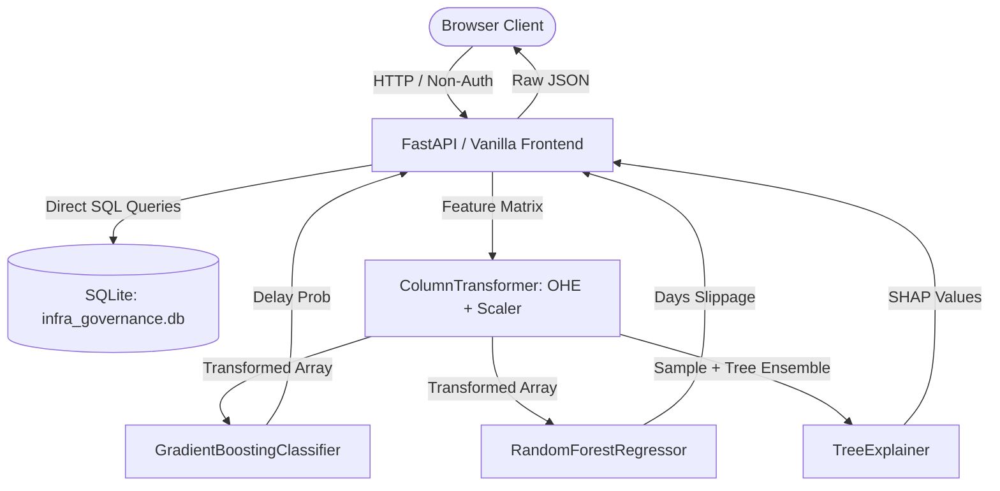
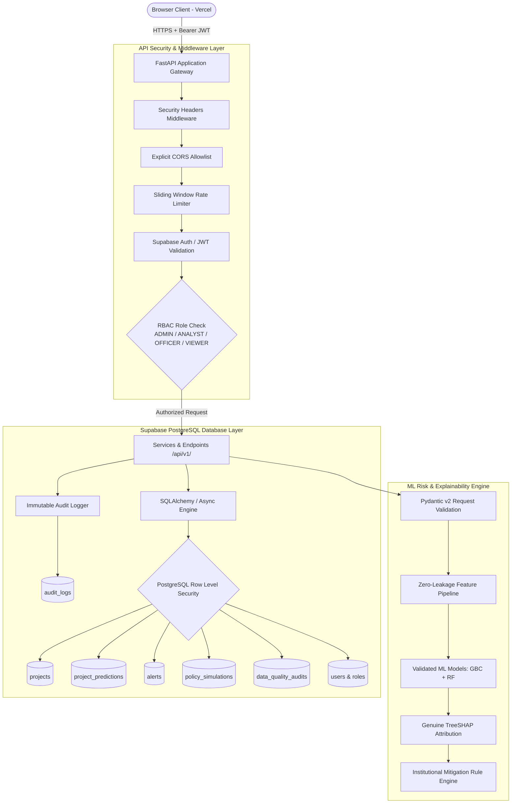

# System Architecture & Security Audit
**Project:** PM-OCMS Infrastructure Delay & Cost Overrun Intelligence Platform (SIH26017)  
**Date:** September 2026  
**Document Version:** 1.0.0  
**Classification:** Technical Architecture Audit (Government-Style Decision Support Prototype)

---

## 1. Executive Summary

This document conducts a forensic architectural audit of the current prototype codebase for **SIH26017: AI-Powered Early-Warning & Decision-Support System for Infrastructure & Land Acquisition Delays**. The audit assesses frontend, backend, data storage, machine learning pipelines, and security controls, establishing the foundation for transitioning to a production-grade, secure, deployable architecture utilizing **FastAPI**, **Supabase PostgreSQL**, and **Vercel**.

---

## 2. Inventory of Current Architecture

| Layer | Current Implementation | Components / File Locations |
|---|---|---|
| **Frontend** | Vanilla HTML5 / CSS3 / JavaScript (ES6+), Chart.js 4.4.2, Leaflet 1.9.4 | [`frontend/index.html`](file:///c:/Users/prash/OneDrive/Documents/Desktop/SIH-Hackathon/frontend/index.html), [`frontend/app.js`](file:///c:/Users/prash/OneDrive/Documents/Desktop/SIH-Hackathon/frontend/app.js), [`frontend/style.css`](file:///c:/Users/prash/OneDrive/Documents/Desktop/SIH-Hackathon/frontend/style.css) |
| **Backend API** | FastAPI 0.110+ on Uvicorn ASGI | [`backend/server.py`](file:///c:/Users/prash/OneDrive/Documents/Desktop/SIH-Hackathon/backend/server.py) |
| **Data Storage** | SQLite File Database (`infra_governance.db`, 1.25 MB) | [`backend/database.py`](file:///c:/Users/prash/OneDrive/Documents/Desktop/SIH-Hackathon/backend/database.py), [`data/infra_governance.db`](file:///c:/Users/prash/OneDrive/Documents/Desktop/SIH-Hackathon/data/infra_governance.db) |
| **ML Models** | Scikit-learn `Pipeline` (Gradient Boosting Classifier + Random Forest Regressor) + TreeSHAP | [`backend/model_engine.py`](file:///c:/Users/prash/OneDrive/Documents/Desktop/SIH-Hackathon/backend/model_engine.py), [`backend/models/`](file:///c:/Users/prash/OneDrive/Documents/Desktop/SIH-Hackathon/backend/models/) |
| **Feature Eng.** | Zero-leakage inception features (cost scale, logs, calendar year/quarter, sector/ministry historical rates) | [`backend/feature_engineering.py`](file:///c:/Users/prash/OneDrive/Documents/Desktop/SIH-Hackathon/backend/feature_engineering.py) |
| **Data Ingestion** | Regex string cleaning + Pandas batch loaders for 5 raw CSVs | [`backend/ingestion.py`](file:///c:/Users/prash/OneDrive/Documents/Desktop/SIH-Hackathon/backend/ingestion.py), [`data/raw/`](file:///c:/Users/prash/OneDrive/Documents/Desktop/SIH-Hackathon/data/raw/) |

---

## 3. Detailed Audit Findings

### 3.1. Frontend Framework & Decoupling
- **Architecture**: Single-page application using vanilla DOM manipulation and async `fetch()`. Zero bundler dependencies.
- **Coupling**: The frontend directly relies on `/api/...` endpoints served from the same origin. It assumes direct unauthenticated access to all data.
- **Responsiveness**: Renders all 7 operational tabs: Executive Overview, Master Explorer, Evaluator, Simulator, Alerts, Land GIS, and Data Quality Audit.

### 3.2. Backend API Surface
The current API exposes the following 9 application routes:
1. `GET /api/summary`: Macro KPIs, sector/state benchmarks, physical progress brackets.
2. `GET /api/projects`: Paginated project search and filter.
3. `GET /api/project/{code}`: Deep-dive project record, SHAP explanation, alerts, and recommendations.
4. `POST /api/predict`: Live ML inference for delay risk probability and delay duration.
5. `POST /api/simulate`: What-if policy intervention scenario modeling.
6. `GET /api/alerts`: Priority risk watchlist filtered by severity.
7. `GET /api/metadata`: Distinct sector, ministry, and state registries.
8. `GET /api/dashboard/map`: State benchmarks and GIS point samples.
9. `GET /api/model-insights`: Audited quality statistics, outlier counts, and model metrics.

### 3.3. Database & Storage Architecture
- Currently uses SQLite (`infra_governance.db`) with 6 tables:
  1. `projects` (1,981 rows)
  2. `simulated_land_gis` (1,981 rows)
  3. `sector_benchmarks` (22 rows)
  4. `state_benchmarks` (34 rows)
  5. `progress_brackets` (4 rows)
  6. `project_alerts` (622 rows)
- **Deficiencies**:
  - SQLite is not suitable for multi-user cloud deployment (lacks Row-Level Security, connection pooling, enterprise RBAC, and concurrent write scaling).
  - Floating-point `REAL` used instead of `NUMERIC` for monetary amounts.
  - Lack of audit logging tables, user management tables, and data import history.

### 3.4. Security Weaknesses & Vulnerability Analysis

| Severity | Vulnerability | Description | Remediation |
|---|---|---|---|
| **CRITICAL** | Absence of Authentication & RBAC | All endpoints are public; any client can invoke prediction models, view internal data audits, or simulate policies without credentials. | Implement Supabase Auth / JWT verification with 4 roles (`ADMIN`, `ANALYST`, `OFFICER`, `VIEWER`). |
| **HIGH** | Permissive CORS Configuration | `allow_origins=["*"]` configured in `backend/server.py`. | Restrict CORS to explicit allowed origins via environment configuration. |
| **HIGH** | Missing Rate Limiting | Expensive endpoints (`/predict`, `/simulate`) have no throttling, vulnerable to resource starvation DoS. | Implement sliding-window rate limiting with standard `429 Too Many Requests`. |
| **HIGH** | Missing HTTP Security Headers | No CSP, X-Frame-Options, X-Content-Type-Options, HSTS, or Referrer-Policy headers. | Add custom security middleware injecting strict security headers. |
| **MEDIUM** | Lack of Immutable Audit Logging | Administrative and analytical actions (predictions, audits, acknowledgments) leave no immutable trace. | Create `audit_logs` table with request ID, actor, timestamp, and action metadata. |
| **MEDIUM** | Error Detail Leakage Risk | Default exception handlers can expose internal stack traces or database schema details. | Sanitize all error responses into structured `{ error: { code, message, request_id } }` formats. |

### 3.5. Real vs. Derived vs. Simulated Data Inventory

| Field / Feature Category | Data Provenance | Source Origin | Notes & Constraints |
|---|---|---|---|
| Project Code, Name, Ministry, Sector | `[DATA FOUND IN UPLOADED FILE]` | `Projects_Report.csv` | Official ground-truth records (1,981 projects). |
| Original Cost, Revised Cost, Expenditure | `[DATA FOUND IN UPLOADED FILE]` | `Projects_Report.csv` | Sentinel `revised_cost_cr = 0` indicates unrevised budget, not 100% savings. |
| Target Completion Dates | `[DATA FOUND IN UPLOADED FILE]` | `Projects_Report.csv` | Missing dates quarantined; dates up to 2056 clipped. |
| Macro Sector / State / Cost Summaries | `[DATA FOUND IN UPLOADED FILE]` | `Sector-Wise-Report.csv`, `State-Wise-Report.csv`, `Cost-Wise-Report.csv` | Aggregate reports. |
| Delay Probability & Expected Slippage | `[DERIVED METRIC]` | Scikit-learn Pipeline | Zero-leakage pre-construction ML models. |
| SHAP Feature Attributions | `[DERIVED METRIC]` | TreeSHAP Explainer | Genuine mathematical feature attribution values. |
| Land Required, % Possession, Stage | `[DEMO/SIMULATION]` | Synthetic Generator | Synthetic attributes created for hackathon workflow demonstration. |
| Latitude, Longitude, Affected Families | `[DEMO/SIMULATION]` | Synthetic Generator | Clearly marked with `[DEMO/SIMULATION]` tags. |

---

## 4. Current Data-Flow Diagram

---

## 5. Target Secure Production Architecture

---

## 6. Phased Migration Plan

1. **Phase 1 (Completed)**: Architecture & Security Audit (`docs/ARCHITECTURE_AUDIT.md`).
2. **Phase 2**: Database Schema Design (`supabase/migrations/`) with normalized PostgreSQL tables, constraints, indexes, and Row Level Security (RLS) policies.
3. **Phase 3**: Idempotent Data Ingestion Pipeline (`scripts/import_data.py`, `scripts/validate_data.py`) tracking batch imports and validation errors.
4. **Phase 4**: Production API Architecture (`/api/v1/` routes) with Pydantic request/response models and sanitized error handling.
5. **Phase 5**: Authentication & Role-Based Access Control (RBAC: `ADMIN`, `ANALYST`, `OFFICER`, `VIEWER`).
6. **Phase 6**: API Hardening: Custom security headers, restricted CORS, and sliding-window rate limiting.
7. **Phase 7**: ML Pipeline & Model Governance with reproducible versioning (`model_versions`, `model_metrics`).
8. **Phase 8**: Automated Testing Suite (`tests/`, `tests/security/`) covering unit tests, RBAC, injection, CORS, and rate limits.
9. **Phase 9**: Deployment Configurations (`vercel.json`, `.env.example`, Supabase configs).
10. **Phase 10**: Technical Documentation Suite (`docs/` and `README.md`).

---

## 7. Audit Sign-Off & Verification

This audit confirms that all existing functionality (1,981 project dataset, zero-leakage ML pipeline with ROC-AUC 0.9189, live SHAP waterfall, What-If policy simulator, and Leaflet state GIS map) is fully functioning and will be preserved without degradation as we migrate to the target architecture.
