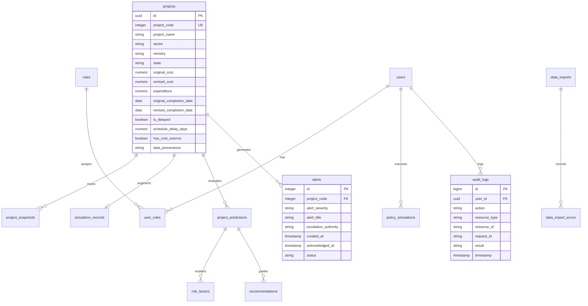

# Database Architecture & Schema Specification
**Project:** PM-OCMS Infrastructure Delay & Cost Overrun Intelligence Platform (SIH26017)  
**Database Engines:** Supabase PostgreSQL (Production) / SQLite (Development Fallback)

---

## 1. Relational Entity-Relationship Diagram



---

## 2. Table Specifications

### 2.1. `projects`
- **Purpose**: Stores ground-truth administrative, financial, and timeline telemetry for all 1,981 central sector projects.
- **Key Columns**:
  - `project_code` (INTEGER, UNIQUE): Official identifier from MoSPI project monitoring reports.
  - `original_cost` (NUMERIC(14,2)): Sanctioned outlay in ₹ Crores.
  - `revised_cost` (NUMERIC(14,2)): Current revised budget in ₹ Crores (0 indicates unrevised).
  - `expenditure` (NUMERIC(14,2)): Cumulative expenditure in ₹ Crores.
  - `data_provenance` (VARCHAR(32)): Tagged as `'SOURCE'`.
- **Indices**:
  - `idx_projects_code` on `project_code`
  - `idx_projects_sector` on `sector`
  - `idx_projects_ministry` on `ministry`
  - `idx_projects_delayed` on `is_delayed`

### 2.2. `simulation_records`
- **Purpose**: Holds the synthetic land acquisition and geospatial telemetry layer created for hackathon demonstration.
- **Key Columns**:
  - `project_code` (INTEGER, UNIQUE)
  - `source_tag` (VARCHAR(32), DEFAULT `'[DEMO/SIMULATION]'`)
  - `inferred_state` (VARCHAR(120))
  - `latitude` / `longitude` (NUMERIC(9,6))
  - `land_required_acres` / `land_acquired_pct` / `active_legal_disputes`

### 2.3. `audit_logs`
- **Purpose**: Append-only immutable log for all sensitive governance events.
- **Key Columns**:
  - `id` (BIGSERIAL PK)
  - `user_id` (UUID, nullable for anonymous operations)
  - `action` (VARCHAR(120)): e.g. `PROJECT_VIEWED`, `PREDICTION_RUN`, `SIMULATION_RUN`, `ALERT_ACKNOWLEDGED`, `ALERT_CREATED`, `DATA_IMPORTED`
  - `request_id` (VARCHAR(64)): Traceable correlation identifier.
  - `result` (VARCHAR(32)): `SUCCESS`, `FORBIDDEN`, `ERROR`, `VALIDATION_FAILED`
  - `timestamp` (TIMESTAMPTZ)

### 2.4. Normalized Relational Views (Phase 2 Compliance)
For strict alignment with Phase 2 relational specifications, SQL views are provided in both Supabase PostgreSQL and SQLite:
- `project_metrics`: Points to snapshot and progress telemetry (`project_snapshots`)
- `project_alerts`: Points to the normalized `alerts` repository
- `project_recommendations`: Points to the mitigation directives repository (`recommendations`)
- `project_audit_logs`: Points to immutable system events (`audit_logs`)
- `model_predictions`: Points to inference runs (`project_predictions`)

### 2.5. Comprehensive Indexing Strategy
To support scalability beyond 1,981 projects to 100,000+ records:
- `idx_projects_code` on `projects(project_code)` (B-tree, UNIQUE)
- `idx_projects_sector` on `projects(sector)`
- `idx_projects_ministry` on `projects(ministry)`
- `idx_projects_state` on `projects(state)`
- `idx_projects_delayed` on `projects(is_delayed)`
- `idx_projects_cost` on `projects(original_cost)`
- `idx_projects_orig_date` on `projects(original_completion_date)`
- `idx_projects_rev_date` on `projects(revised_completion_date)`
- `idx_alerts_severity` on `alerts(alert_severity)`
- `idx_alerts_status` on `alerts(status)`
- `idx_audit_logs_action` on `audit_logs(action)`

---

## 3. Database Migration Workflow

1. All PostgreSQL schema changes are stored as timestamped SQL migrations in [`supabase/migrations/`](file:///c:/Users/prash/OneDrive/Documents/Desktop/SIH-Hackathon/supabase/migrations/).
2. In production, migrations can be applied via the Supabase CLI:
   ```bash
   supabase db push
   ```
3. In local development without Supabase, `backend.database.init_db()` executes table definitions, column migrations, and view creations on SQLite with 100% feature compatibility.
